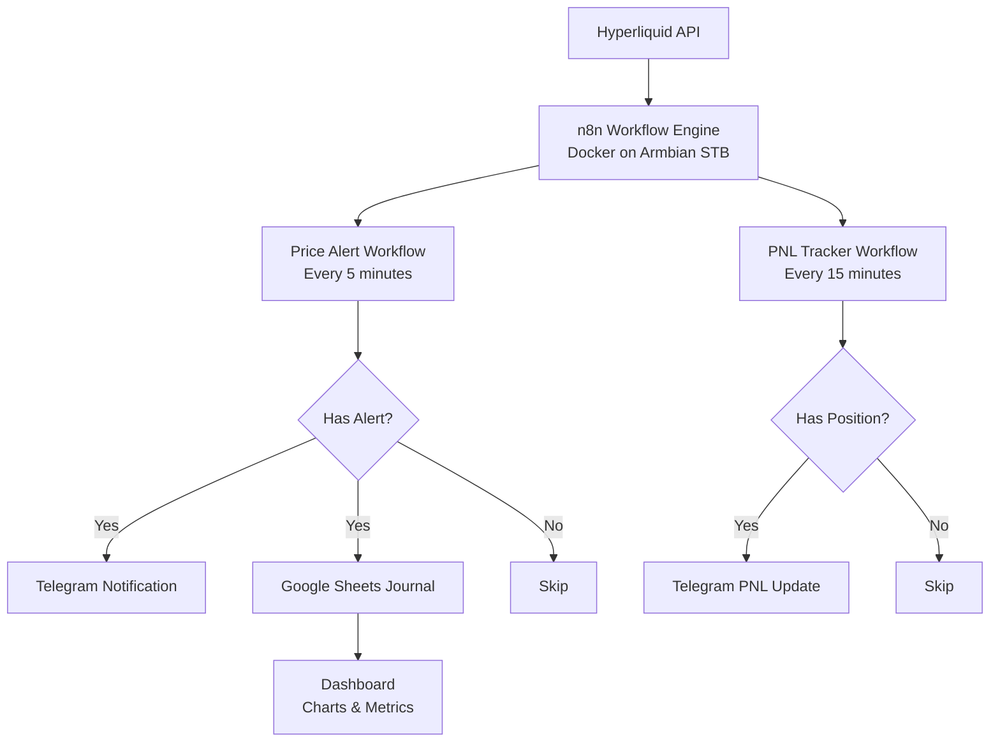

# 🚀 Hyperliquid Trading Automation System

Automated trading monitoring system for Hyperliquid DEX using n8n workflow automation, Telegram notifications, and Google Sheets dashboard.

## 📋 Overview

This project automates the monitoring and journaling of perpetual futures trading on Hyperliquid DEX. Built as a learning project combining trading knowledge with automation engineering.

## ✨ Features

### 🔔 Price Alert System
- Real-time price monitoring every 5 minutes via Hyperliquid public API
- Smart anti-spam system using persistent JSON storage (survives server restarts)
- Multi-level alerts: Take Profit, Stop Loss, and Warning levels
- Instant Telegram notifications

### 📊 PNL Tracker
- Automatic PNL updates every 15 minutes
- Fetches live position data from Hyperliquid API
- Detailed position summary via Telegram

### 📒 Auto Journal
- Automatic trade event logging to Google Sheets
- Records: Timestamp, Pair, Direction, Entry Price, Alert Price, Alert Type, PNL
- Zero manual input required

### 📈 Trading Dashboard
- Win Rate calculation
- Total PNL tracking
- Best and Worst trade analysis
- Pie chart: TP vs SL vs WARNING distribution
- Line chart: Cumulative PNL growth over time

## 🛠️ Tech Stack

| Technology | Purpose |
|---|---|
| n8n (self-hosted) | Workflow automation engine |
| Hyperliquid API | Real-time price & position data |
| Telegram Bot API | Push notifications |
| Google Sheets API | Data storage & visualization |
| Docker | Container deployment |
| Armbian Linux | Host OS (STB HG680p) |
| Node.js | Code execution in n8n |

## 🏗️ Architecture


## 📁 Workflow Structure

### Workflow 1: Hyperliquid Price Alert
Schedule Trigger (5 min)
→ HTTP Request (Hyperliquid allMids API)
→ Code in JavaScript (price check + anti-spam)
→ IF (hasAlert = true)
→ Telegram (send notification)
→ HTTP Request (fetch PNL)
→ Code (parse PNL)
→ Google Sheets (append journal row)

### Workflow 2: Hyperliquid PNL Tracker
Schedule Trigger (15 min)
→ HTTP Request (Hyperliquid clearinghouseState API)
→ Code in JavaScript (parse positions)
→ IF (hasPositions = true)
→ Telegram (send PNL summary)

## ⚙️ Setup

### Prerequisites
- n8n self-hosted (Docker)
- Telegram Bot Token (via @BotFather)
- Google Sheets API credentials (OAuth2)
- Hyperliquid wallet address

### Environment Variables
```bash
docker run -d \
  --name n8n \
  --restart unless-stopped \
  -p 5678:5678 \
  -v /your/path/n8n:/home/node/.n8n \
  -e TZ=Asia/Jakarta \
  -e GENERIC_TIMEZONE=Asia/Jakarta \
  -e NODE_FUNCTION_ALLOW_BUILTIN=fs \
  -e NODE_FUNCTION_ALLOW_EXTERNAL=* \
  n8nio/n8n:latest
```

### Alert Configuration
Edit the alerts array in the Price Alert workflow Code node:
```javascript
const alerts = [
  { level: 73.958, type: "TP",      direction: "above", key: "tp_main"    },
  { level: 64.28,  type: "SL",      direction: "below", key: "sl_main"    },
  { level: 71.00,  type: "WARNING", direction: "above", key: "warn_above" },
  { level: 66.00,  type: "WARNING", direction: "below", key: "warn_below" }
];
```

## 📊 Google Sheets Structure

### Sheet1 — Raw Journal
| Column | Description |
|---|---|
| Timestamp | Date and time of alert |
| Pair | Trading pair (e.g. HYPE-USDC) |
| Arah | Position direction (LONG/SHORT) |
| Entry Price | Position entry price |
| Harga Saat Alert | Price when alert triggered |
| Level Alert | Alert price level |
| Tipe Alert | Alert type (TP/SL/WARNING) |
| PNL Saat Itu | Unrealized PNL at alert time |
| Hasil | Trade result (WIN/LOSS/NEUTRAL) |
| Cumulative PNL | Running total PNL |

### Dashboard — Metrics & Charts
- Trading summary statistics
- Win rate calculation
- Pie chart: Alert distribution
- Line chart: Cumulative PNL growth

## 🔒 Security Notes
- Only public wallet address is used (read-only)
- No private keys stored anywhere
- All credentials managed via n8n credential manager

## 📚 Learning Context
This project was built as part of a structured learning journey in:
- Perpetual futures trading on decentralized exchanges
- Workflow automation with n8n
- API integration and data pipeline design
- Trading risk management principles

## 🗺️ Roadmap
- [ ] Multi-pair monitoring (BTC, ETH)
- [ ] Funding rate spike alerts
- [ ] Trading bot (after 6 months consistent manual trading)
- [ ] Backtesting module

## 👤 Author
Built by a System Information student learning the intersection of technology and decentralized finance.

---
*Built with n8n, Hyperliquid API, and lots of learning* 🚀
